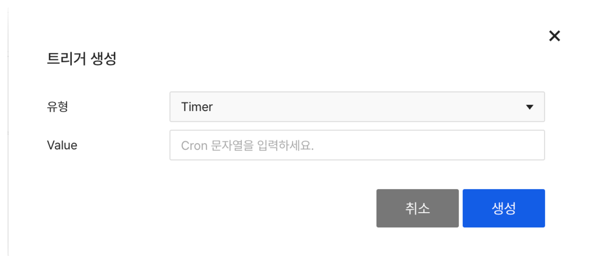
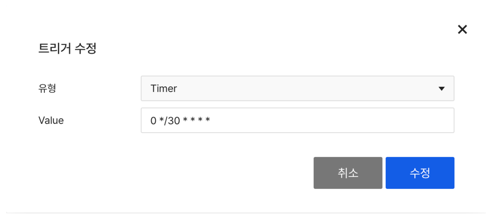
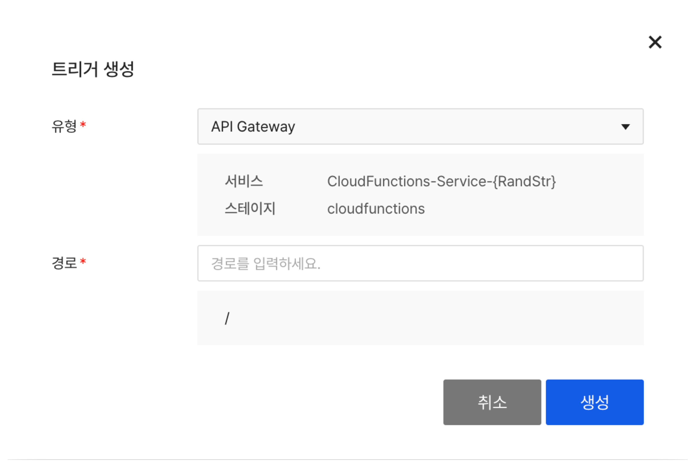
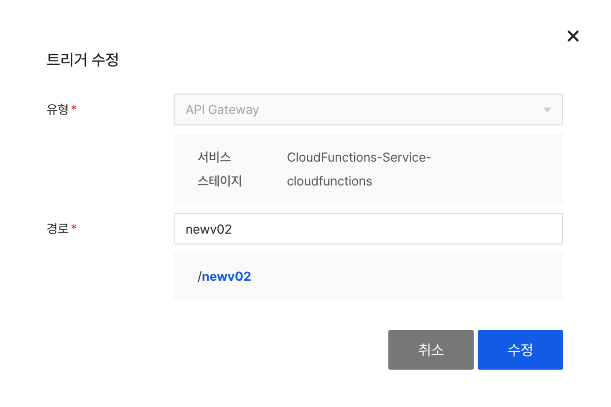
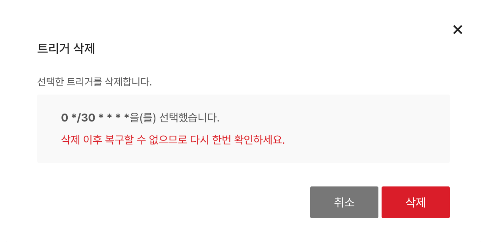

<!-- pre-align:aligned sig=1dfb7cf11d02 -->

<a id="compute-cloud-functions-trigger-guide"></a>
## Compute > Cloud Functions > Trigger Guide { #compute-cloud-functions-trigger-guide }

This document describes the trigger types available in Cloud Functions and how to set them up.

<a id="trigger-overview"></a>
## Trigger Overview { #trigger-overview }

Trigger is an event source to execute functions. Cloud Functions provide various triggers to allow you to call functions in multiple ways.

<a id="supported-triggers"></a>
### Supported Triggers { #supported-triggers }

| Types | Descriptions | Built-in |
|-------------|------------------------|-------|
| HTTP | Execute a function via an HTTP request | Yes |
| Timer | Execute a function at a specified time or interval | No |
| API Gateway | Execute a function via API Gateway | No |

<a id="http-trigger"></a>
## HTTP Trigger { #http-trigger }

HTTP trigger is built-in when creating a function, and you can execute the function with an HTTP request.

<a id="features"></a>
### Features { #features }

- When creating a function, it will be automatically created.
- It cannot be deleted but only enabled or disabled.
- GET, POST methods are supported.

<a id="url-format-of-http-trigger"></a>
### URL Format of HTTP Trigger { #url-format-of-http-trigger }

```
https://{userdomain}/{function name}
```

<a id="examples"></a>
### Examples { #examples }

<a id="examples-request-get"></a>
#### Request GET

```bash
curl -X GET "https://{userdomain}/{function name}?param1=value1&param2=value2"
```

<a id="examples-request-post"></a>
#### Request POST

```bash
curl -X POST "https://{userdomain}/{function name}" \
  -H "Content-Type: application/json" \
  -d '{"key": "value"}'
```

<a id="enabledisable-http-trigger"></a>
### Enable/disable HTTP Trigger { #enabledisable-http-trigger }

1. Select a function from the Cloud Functions console.
2. Go to **Trigger** tab.
3. Click Enable/Disable toggle for HTTP triggers.

> **[Note]**
> <br>If you send a request with a disabled HTTP trigger, the function will not execute.

<a id="timer-trigger"></a>
## Timer Trigger { #timer-trigger }

Timer trigger executes a function automatically at the specified time or cycle. You can set up the cycle by using the Cron expression.

<a id="create-timer-trigger"></a>
### Create Timer Trigger { #create-timer-trigger }



1. Select a function from the Cloud Functions console.
2. Go to **Trigger** tab.
3. Click **Generate Trigger**.
4. Select the type as **Timer**.
5. Enter Cron expression in **Value**.
6. Click **Create**.

<a id="cron-expression-format"></a>
### Cron Expression Format { #cron-expression-format }

Cron expression follows the format as below:

```
* * * * * *
│ │ │ │ │ │
│ │ │ │ │ └─ Day of week (0-6 or SUN-SAT, 0: sunday)
│ │ │ │ └─── Month (1-12 or JAN-DEC)
│ │ │ └───── Day of month (1-31)
│ │ └─────── hour (0-23)
│ └───────── minute (0-59)
└─────────── second (0-59)
```

<a id="cron-expression-format-cron-expression-field"></a>
#### Cron Expression Field

| Field | Required | Allowed vale | Allowed special character |
|-----------------|-----|-----------------|-----------|
| Seconds | Yes | 0-59 | * / , - |
| Minutes | Yes | 0-59 | * / , - |
| Hours | Yes | 0-23 | * / , - |
| Day of month | Yes | 1-31 | * / , - ? |
| Month | Yes | 1-12 or JAN-DEC | * / , - |
| Day of week | Yes | 0-6 or SUN-SAT | * / , - ? |

<a id="cron-expression-format-special-characters-details"></a>
#### Special Characters Details

`*`

Indicate that all values ​​in the field match. For example, using `*` in the 5th field (month) means all months.

`/`

Used to indicate the increment of a range. For example, using `3-59/15` in the 2nd field (minutes) means it will execute every 15 minutes starting at 3 minutes (3, 18, 33, and 48 minutes). For `*/...` format, it matches `first-last/...` format and indicates that the increment for the largest range of the field. For `N/...` format, it indicates `N-MAX/...`, using increments starting from N to the end of the range. Once you go beyond the range, you won't go back to the beginning.

`,`

Used to separate items in a list. For example, using `MON,WED,FRI` in the 6th field (day of the week) means Monday, Wednesday, and Friday.

`-`

Used to define scope. For example, using `9-17` in the third field (hours) means all hours from 9 AM to 5 PM (inclusive).

`?`

You can use * instead of leaving the Day of month or Day of week field blank.

<a id="example-of-cron-expression"></a>
### Example of Cron Expression { #example-of-cron-expression }

| Cron Expression | Description |
|------------------------|---------------------------------|
| `0 * * * * *` | Execute every minute (at 0 seconds) |
| `0 0 * * * *` | Execute every hour on the hour |
| `0 0 0 * * *` | Execute every midnight |
| `0 0 9 * * MON` | Execute every Monday at 9:00 AM |
| `0 0 0 1 * *` | Execute every 1st of every month at midnight |
| `0 */5 * * * *` | Execute every 5 minutes |
| `0 0 9-18 * * MON-FRI` | Execute every hour from 9:00 AM to 6:00 PM on weekdays (Mon-Fri) |
| `30 0 12 * * *` | Execute every day at 12:00:30 PM |
| `0 0 0 1 JAN *` | Execute every January 1st at midnight |

<a id="modify-timer-trigger"></a>
### Modify Timer Trigger { #modify-timer-trigger }



1. Select a function from the Cloud Functions console.
2. Go to **Trigger** tab.
3. Select the Timer trigger to be modified.
4. Click **Modify Trigger**.
5. Modify the Cron expression of the **Value**.
6. Click **Modify**.

> **[Note]**
> <br>The Month and Day of week field values ​​are case-insensitive. "SUN", "Sun", "sun" are all recognized equally.

<a id="api-gateway-trigger"></a>
## API Gateway Trigger { #api-gateway-trigger }

API Gateway triggers can execute functions by leveraging the API Gateway service in the same project. API Gateway enables more detailed API management and control.

<a id="prerequisites"></a>
### Prerequisites { #prerequisites }

- The API Gateway service must be enabled in the same project.
  - If it isn't enabled, you can enable it when creating a trigger.

<a id="create-api-gateway-trigger"></a>
### Create API Gateway Trigger { #create-api-gateway-trigger }



1. Select a function from the Cloud Functions console.
2. Go to **Trigger** tab.
3. Click **Generate Trigger**.
4. Select API Gateway from the type.
5. Enter the path to use.
   * Duplicate path is unavailable.
6. Click **Create**.

<a id="api-gateway-trigger-url-format"></a>
### API Gateway Trigger URL Format { #api-gateway-trigger-url-format }

```
https://{stageurl}/{path}
```

<a id="api-gateway-trigger-examples"></a>
### Examples { #api-gateway-trigger-examples }

<a id="api-gateway-trigger-examples-request-get"></a>
#### Request GET

```bash
curl -X GET "https://{stageurl}/{path}?param1=value1&param2=value2"
```

<a id="api-gateway-trigger-examples-request-post"></a>
#### Request POST

```bash
curl -X POST "https://{stageurl}/{path}" \
  -H "Content-Type: application/json" \
  -d '{"key": "value"}'
```

<a id="features-of-api-gateway-trigger"></a>
### Features of API Gateway Trigger { #features-of-api-gateway-trigger }

- You can leverage various features of API Gateway.
  - Manage authentication and permission
  - Convert request/response
  - Manage usage plan and API key
  - Request restriction
- You can manage API settings from the API Gateway console.
- Integrating functions is available only in a single automatically generated service.
- The service supports GET and POST methods, same as HTTP triggers.

<a id="modify-api-gateway-trigger"></a>
### Modify API Gateway Trigger { #modify-api-gateway-trigger }



1. Select a function from the Cloud Functions console.
2. Go to **Trigger** tab.
3. Select API Gateway trigger to modify.
4. Click **Modify Trigger**.
5. Changes the path.
6. Click **Modify**.

> **[Note]**
> <br>Modifying an API Gateway trigger involves deleting the existing trigger within the API Gateway service and then creating a new one.
> <br>It results in deleting all plugins applied to the corresponding resource.
> <br>If you want to change the resource path to which the plugin is applied, we recommend adding a new trigger instead of modifying it.

<a id="use-with-api-gateway"></a>
### Use with API Gateway { #use-with-api-gateway }

Once you create an API Gateway trigger, you can configure additional settings in the API Gateway console.

For more details, please refer to the [API Gateway Guide](https://docs.nhncloud.com/ko/Application%20Service/API%20Gateway/ko/overview/).

<a id="delete-trigger"></a>
## Delete Trigger { #delete-trigger }

<a id="how-to-delete-trigger"></a>
### How to Delete Trigger { #how-to-delete-trigger }



1. Select a function from the Cloud Functions console.
2. Go to **Trigger** tab.
3. Select the trigger to delete (multiple choices available).
4. Click **Delete Trigger**.
5. Click **Delete** from the modal window of **Delete Trigger**.

<a id="cautions"></a>
### Cautions { #cautions }

- You cannot delete HTTP trigger. HTTP trigger is built-in, only being enabled or disabled.
- If deleting the trigger, you cannot execute the function through the event.
- Deleted triggers cannot be recovered.

<a id="restrictions"></a>
## Restrictions { #restrictions }

<a id="restrictions-for-api-gateway-trigger"></a>
### Restrictions for API Gateway Trigger { #restrictions-for-api-gateway-trigger }

- You can only connect API Gateways within the same project.
- A single API Gateway resource can only be connected with one function. A single function can register multiple API Gateway triggers.
- You can register multiple API Gateway triggers for a single function.
- If the API Gateway service is disabled or the associated resource is deleted or modified, the trigger will no longer work.
  - In this case, the trigger cannot be modified, so you must delete it and re-register it. 